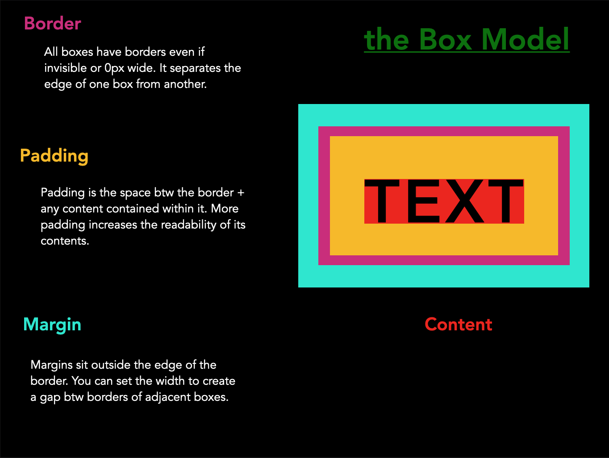

##### CSS Positioning Studio!
  * with a partner create a WoS inspired website using this [MDN tutorial](https://developer.mozilla.org/en-US/docs/Learn/CSS/CSS_layout/Positioning)

##### [Chrome Dev Tools Console Ref](https://developers.google.com/web/tools/chrome-devtools/console/reference)

#### [the Box Model](https://developer.mozilla.org/en-US/docs/Web/CSS/CSS_Box_Model/Introduction_to_the_CSS_box_model)

* [MDN on padding](https://developer.mozilla.org/en-US/docs/Web/CSS/padding)
* [MDN on border](https://developer.mozilla.org/en-US/docs/Web/CSS/border) 
* [MDN on margin](https://developer.mozilla.org/en-US/docs/Web/CSS/margin)

##### Positioning
* [MDN Getting STarted](https://developer.mozilla.org/en-US/docs/Web/CSS/position)
* [MDN Float Tutorial](https://developer.mozilla.org/en-US/docs/Learn/CSS/CSS_layout/Floats)

##### CSS Resources
* [MDN CSS Property Index](https://developer.mozilla.org/en-US/docs/Web/CSS/Reference)
* [MDN positioning](https://developer.mozilla.org/en-US/docs/Web/CSS/position)
* [MDN layout](https://developer.mozilla.org/en-US/docs/Web/CSS/Reference#layout)
* [cssreference.io - CC Property Reference](https://cssreference.io/) - Free visual guide 
* [Display Property](https://developer.mozilla.org/en-US/docs/Web/CSS/display)

##### HTML 5 Tags:
  * [MDN article tag](https://developer.mozilla.org/en-US/docs/Web/HTML/Element/article)
  * [MDN section tag ](https://developer.mozilla.org/en-US/docs/Web/HTML/Element/section)
  * [MDN header tag](https://developer.mozilla.org/en-US/docs/Web/HTML/Element/header)
  * [MDN footer tag](https://developer.mozilla.org/en-US/docs/Web/HTML/Element/footer)
  * [MDN navigation tag](https://developer.mozilla.org/en-US/docs/Web/HTML/Element/nav)

  ##### CSS Units of Measurement
* [w3 Schools CSS units](https://www.w3schools.com/cssref/css_units.asp)
* [MDN CSS units, lengths](https://developer.mozilla.org/en-US/docs/Learn/CSS/Building_blocks/Values_and_units)
* [A Pixel is not a Pixel](https://www.quirksmode.org/blog/archives/2010/04/a_pixel_is_not.html)

